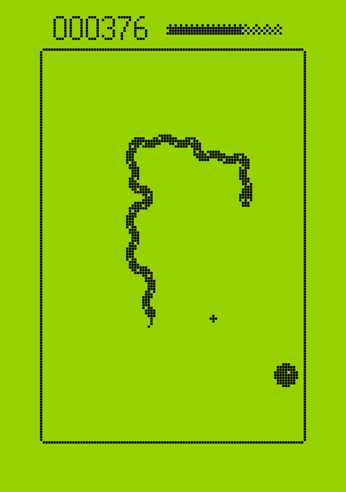

# Snake Xenzia



## Introduction

The program is a game called snake xenzia that uses the arrows of the keyboard for control. The aim is for the user to eat as much food as possible with the snake, hence scoring higher, without crushing the snake into itself. This program is a mere remake of the classic Snake Xenzia game that was very popular in the early 2000s.

## Table of contents

1. [Description](#description)
2. [Getting Started](#getting-started)
    - [Dependancies](#dependencies)
    - [Installing](#installing)
3. [Executing Program](#executing-program)
    - [Running the program in an IDE](#running-the-program-in-an-ide)
    - [Running the executable program](#running-the-program-from-the-command-line)
4. [Help](#help)
5. [Authors](#authors)
6. [Acknowledgements](#acknowledgments)

## Description

The snake xenzia is meant to be a fun and easy game for users. Here implemented in Ruby, the game is a remake of its classic version. Users can play the game using their keyboard. The goal is for the player to collect as much food as possible with the snake and score high. The game ends when the snake crushes into itself, that is, when it bites itself. The program is still under development and collaborators are welcome.  

## Getting Started

### Dependencies

This program was created using Ruby3 and runs on that version. The main library needed is the `ruby2d` gem for drawing the graphical user interface. 

### Installing

Users can download the folder of files on [github](https://github.com/amutaya/a-8) and clone the repository. Once downloaded, you can run the `init.rb` file in any IDE or using the command line. The folder comes with the required files for running the program. It also includs the build folder for the executable of the program. Hence users can also run `./app` in the terminal and get the game started. 

## Executing Program

### Running the program in an IDE

* Ensure that you have downloaded `game.rb`, `snake.rb` and `init.rb`.
* Run `init.rb` in any IDE of your choice and the game will start. 
* For example, in terminal, you can run:
```
ruby init.rb
```
and the game snake xenzia window will pop up hence starting the game. 

### Running the executable program 

You can also run the application version of the game using the command line by typing:

```
./app
```

## Help

* The game only uses arrows for moving the snake, and prints out the other instructions to the screen. For example, it tells the user to press P to pause or unpause the game. 

## Authors

Minor edits to the program made by Annah N Mutaya 
[@amutaya](https://github.com/amutaya)

## Acknowledgments

* [Let's create a snake game in ruby](https://www.youtube.com/watch?v=2UVhYHBT_1o&ab_channel=MarioVisic
* [Markdown template](https://gist.github.com/DomPizzie/7a5ff55ffa9081f2de27c315f5018afc)
* [Ruby 2D documentation](https://www.ruby2d.com/)

